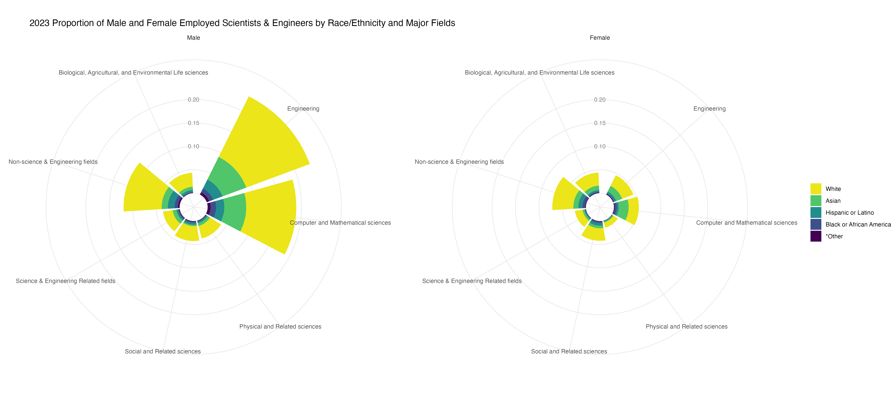
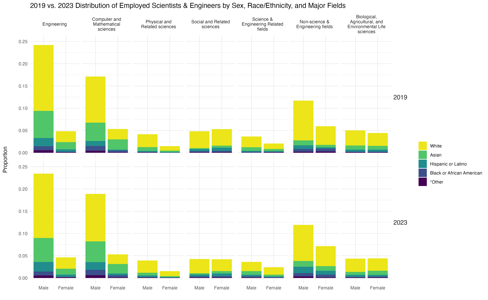

```{r}
#| label: load-packages
#| include: false

library(tidyverse)
library(readxl)
library(paletteer)
```

## Data Description

This data comes from the **National Science Foundation**, specifically the [*National Center for Science and Engineering Statistics*.](https://ncsesdata.nsf.gov/explorer/datatables)  The data tables used were **nsf22310-tab001-005** (2019 survey data) and **nsf25322-tab001-005** (2023 survey data) - both titled "Employed scientists and engineers, by sex, major field of highest degree, ethnicity, race, disability status, and type of disability."  

The tables contain survey data capturing the count of employed individuals across generalized STEM fields, broken down by sex (male/female), race/ethnicity within each sex category, and disability status.

## Data Cleaning

The first 15 rows were skipped when reading in the Excel document from NSF; manual column labels were added.  Skipping these rows bypassed the original row subheading format in the original Excel and excluded the section of data without Male/Female Sex classification.  Non-zero count values marked with "*", "D", or "S" were converted to NA as the data was read in.

Since these visualizations centered on sex and race/ethnicity representation, columns related to disability representation were dropped.  The original race/ethnicity labels that were spread across column headers were pivoted into a single "race/ethnicity" column with a parallel "count" column so that each count appeared as a distinct row.

A "sex" column was added to designate rows by male or female, eliminating the subheading structure within the first column of the original table. The "total" column was removed (its values no longer aligned with the reformatted "count" and "race/ethnicity" columns).

The race/ethnicity column compiled the low count categories — "American Indian or Alaska Native", "Native Hawaiian or Other Pacific Islander", and "Multiracial" — into a single "Other" category, allowing these counts to be visible in the final graphic relative to the larger groups of "Black or African American", "Asian", "Hispanic or Latino", and "White".

Finally, a proportion column was calculated and added to show the proportion of each race/ethnicity within each sex category relative to the total of all counts. A year column was added to each table and the two tables were joined to create the side-by-side bar chart comparison.


## Data Visualization 1

These two circular bar charts show data from 2023, comparing representation of men (right chart) and women (left).  The contrast of larger reflects the broader imbalance between men and women in STEM. Engineering and Computer and Mathematical Sciences show the most dramatic difference, with both of these fields having a greater number of employed individuals overall and those individuals being predominantly men.

The charts also show a compounding underrepresentation: beyond the gender gap, Hispanic or Latino, Black or African American, and other racial and ethnic groups remain significantly underrepresented across all fields in both charts, with White employees making up the majority and Asian employees as the next largest group.


```{r}
#| echo: false
#| fig-alt: "Two circular bar charts representing male (on left) and female (on right). The two circular plots show the proportion overall of employed scientists and engineers in 2023 by race/ethnicity and by generalized fields of study (Engineering, Computer and Mathematical Sciences, Physical and Related Sciences, Social and Related Sciences, Science & Engineering Related Fields, Non-Science & Engineering Fields, and finally Biological, Agricultural, and Environmental Life Sciences). The left chart shows greater proportions of men in science – especially in the fields of Engineering and Computer and Mathematical Sciences. Both graphs clearly show through the color legend high proportions of White men and White women, followed by proportions of Asian, then Hispanic or Latino, and Black or African American, and a category of Other that represents American Indian or Alaska Natives, Native Hawaiian or Other Pacific Islanders, and Multiracial employed men and women."
#| fig-cap: "2023 proportion of employed scientists and engineers by race/ethnicity and major field, shown separately by sex. Source: National Science Foundation, National Center for Science and Engineering Statistics (nsf25322-tab001-005). \n **Other** = combined categories of *American Indian or Alaska Native*, *Native Hawaiian or Other Pacific Islander*, and *Multiracial*."



```

## Data Visualization 2

These two bar charts show the change from 2019 to 2023 in the proportion of men and women across major STEM fields and the distribution of race/ethnicity within those groups. While slight shifts are visible between the two years, both charts reflect the continued dominance of male and White representation across all fields. 


```{r}
#| echo: false
#| fig-alt: "Two barplots stacked on top of each other representing the year 2019 and then the year 2023. The plots outline the proportion of distinct race/ethnicities of employed scientists and engineers in generalized fields of study (Engineering, Computer and Mathematical Sciences, Physical and Related Sciences, Social and Related Sciences, Science & Engineering Related Fields, Non-science & Engineering Fields, and finally Biological, Agricultural, and Environmental Life Sciences). The barplots show bars comparing proportion of men and women represented in each field with the stacked proportions showing the distribution of each race/ethnicity withing the groups of women and men in each field."
#| fig-cap: "2019 vs. 2023 proportion of employed scientists and engineers by sex, race/ethnicity, and major field. Source: National Science Foundation, National Center for Science and Engineering Statistics (nsf22310-tab001-005; nsf25322-tab001-005).  \n **Other** = combined categories of *American Indian or Alaska Native*, *Native Hawaiian or Other Pacific Islander*, and *Multiracial*." 


```

When one begins to look deeper at the history of science and recognize the advancements that have come as women entered the arena of science, it becomes clear that science advances dramatically with the incorporation of diverse backgrounds and perspectives. These charts showcase how we must still work to create diverse scientific arenas to foster greater exploration, advancement, and equity for all.

```{r}
#| include: false 

#Questions to investigate: 

#How do the number of men and women in major STEM fields (BIO, COMPUTER SCI, PHYSICAL, SOCIAL, ENGINEER, etc.) compare to one another?

#How do the different race categories compare to one another?

#Have there been any shifts in those proportions between 2019 and 2023?
```


```{r}
#| label: read-in-and-clean-data
#| include: false
#single code chuck data

tbl2019_stemfields_clean <- read_excel("data-raw/nsf22310-tab001-005.xlsx", 
                                 skip = 15, 
                                 col_names = c("field", 
                                               "total", 
                                               "hisp_lat", 
                                               "amer_ind_alaskan", 
                                               "asian", 
                                               "black_afri_amer", 
                                               "nat_hawaii_pacific_islander", 
                                               "white", 
                                               "multi_race", 
                                               "a", "b", "c", "d", "e", "f", "g"),
                                 na = c("D", "N", "*", "S")) |>
  select("field", "total", "hisp_lat", "amer_ind_alaskan", "asian", "black_afri_amer", "nat_hawaii_pacific_islander", "white", "multi_race") |>
  pivot_longer(!c(field, total), 
               names_to = "ethnicity_race", 
               values_to = "count") |>
  select(!total) |>
  slice(-c(57:63)) |>
  mutate(sex = case_when(
    row_number() <= 56 ~ "Female",
    row_number() > 56 & row_number() <= 112 ~ "Male")) |>
  filter(field != "S&E fields") |>
    mutate(ethnicity_race = case_when(
        ethnicity_race == "hisp_lat" ~ "Hispanic or Latino",
        ethnicity_race == "amer_ind_alaskan" ~ "*Other", 
        ethnicity_race == "asian" ~ "Asian",
        ethnicity_race == "black_afri_amer" ~ "Black or African American",
        ethnicity_race == "nat_hawaii_pacific_islander" ~ "*Other",
        ethnicity_race == "white" ~ "White", 
        ethnicity_race == "multi_race" ~ "*Other")) |>  
  mutate(SE_type = case_when(
    field == "S&E-related fields" ~ "SE_related_fields",
    field == "Non-S&E fields" ~ "non_SE_fields",
    .default = "SE_field")) |>
  mutate(field = case_when(
    field == "Biological, agricultural, and environmental life sciences" ~ "Biological, Agricultural, and Environmental Life sciences",
    field == "S&E-related fields" ~ "Science & Engineering Related fields",
    field == "Non-S&E fields" ~ "Non-science & Engineering fields",
    field == "Engineering" ~ "Engineering",
    field == "Computer and mathematical sciences" ~ "Computer and Mathematical sciences",
    field == "Social and related sciences" ~ "Social and Related sciences",
    field == "Physical and related sciences" ~ "Physical and Related sciences")) |>
  mutate(year = 2019) |>
  group_by(field) |>
  mutate(prop_byfield = count/(sum(count, na.rm = TRUE))) |>
  ungroup() |>
  group_by(field, sex) |>
  mutate(prop_bysex = count/(sum(count, na.rm = TRUE))) |>
  ungroup() |>
  mutate(prop = count/(sum(count, na.rm = TRUE)))
  

```


```{r}
#| label: write-clean-2019-data-to-folder
#| include: false

write_csv(tbl2019_stemfields_clean, file = "data-clean/tbl2019_stemfields_clean.csv")
```

```{r}
#| label: single-code-chunk-clean-data-2023
#| include: false

tbl2023_stemfields_clean <- read_excel("data-raw/nsf25322-tab001-005.xlsx", 
                                 skip = 15, 
                                 col_names = c("field", 
                                               "total", 
                                               "hisp_lat", 
                                               "amer_ind_alaskan", 
                                               "asian", 
                                               "black_afri_amer", 
                                               "nat_hawaii_pacific_islander", 
                                               "white", 
                                               "multi_race", 
                                               "a", "b", "c", "d", "e", "f", "g"),
                                 na = c("D", "N", "*", "S")) |>
  select("field", "total", "hisp_lat", "amer_ind_alaskan", "asian", "black_afri_amer", "nat_hawaii_pacific_islander", "white", "multi_race") |>
  pivot_longer(!c(field, total), 
               names_to = "ethnicity_race", 
               values_to = "count") |>
  select(!total) |>
  slice(-c(57:63)) |>
  mutate(sex = case_when(
    row_number() <= 56 ~ "Female",
    row_number() > 56 & row_number() <= 112 ~ "Male")) |>
  filter(field != "S&E fields") |>
  mutate(ethnicity_race = case_when(
    ethnicity_race == "hisp_lat" ~ "Hispanic or Latino",
    ethnicity_race == "amer_ind_alaskan" ~ "*Other", 
    ethnicity_race == "asian" ~ "Asian",
    ethnicity_race == "black_afri_amer" ~ "Black or African American",
    ethnicity_race == "nat_hawaii_pacific_islander" ~ "*Other",
    ethnicity_race == "white" ~ "White", 
    ethnicity_race == "multi_race" ~ "*Other")) |>  
  mutate(SE_type = case_when(
    field == "S&E-related fields" ~ "SE_related_fields",
    field == "Non-S&E fields" ~ "non_SE_fields",
    .default = "SE_field")) |>
  mutate(field = case_when(
    field == "Biological, agricultural, and environmental life sciences" ~ "Biological, Agricultural, and Environmental Life sciences",
    field == "S&E-related fields" ~ "Science & Engineering Related fields",
    field == "Non-S&E fields" ~ "Non-science & Engineering fields",
    field == "Engineering" ~ "Engineering",
    field == "Computer and mathematical sciences" ~ "Computer and Mathematical sciences",
    field == "Social and related sciences" ~ "Social and Related sciences",
    field == "Physical and related sciences" ~ "Physical and Related sciences")) |>
  mutate(year = 2023) |>
  group_by(field) |>
  mutate(prop_byfield = count/(sum(count, na.rm = TRUE))) |>
  ungroup() |>
  group_by(field, sex) |>
  mutate(prop_bysex = count/(sum(count, na.rm = TRUE))) |>
  ungroup() |>
  mutate(prop = count/(sum(count, na.rm = TRUE)))
  

```


```{r}
#| label: write-clean-2023-data-to-folder
#| include: false

write_csv(tbl2023_stemfields_clean, file = "data-clean/tbl2023_stemfields_clean.csv")
```


```{r}
#| label: circular-column-chart-2023
#| include: false

tbl2023_stemfields_clean |> 
  filter(!is.na(count)) |>
  ggplot(aes(y = prop,
             x = fct_relevel(field, c("Engineering",
                                    "Computer and Mathematical sciences", 
                                    "Physical and Related sciences", 
                                    "Social and Related sciences", 
                                    "Science & Engineering Related fields", 
                                    "Non-science & Engineering fields",
                                    "Biological, Agricultural, and Environmental Life sciences")), 
             fill= fct_relevel(ethnicity_race, c("White", 
                                                 "Asian",
                                                 "Hispanic or Latino",
                                                 "Black or African American", 
                                                 "*Other")))) +
  geom_col(position = position_stack()) +
  facet_wrap(~fct_relevel(sex, c("Male", "Female"))) +
  labs(y = "Field",
       x = "Proportions",
       title = "2023 Proportion of Male and Female Employed Scientists & Engineers by Race/Ethnicity and Major Fields",
       fill = "") +
  theme_minimal() +
  scale_fill_viridis_d(direction = -1, end = 0.97) +
  theme(panel.spacing = unit(4, "cm"),
    legend.position = c(1.12, 0.5),
    plot.margin = unit(c(1, 6, 1, 1), "cm"),
    axis.title = element_blank(),
    axis.text.y = element_blank()) +
  annotate("text", x = 0, y = 0.1, label = "0.10", size = 3, color = "grey50") +
  annotate("text", x = 0, y = 0.2, label = "0.20", size = 3, color = "grey50") +
  annotate("text", x = 0, y = 0.15, label = "0.15", size = 3, color = "grey50") +
  coord_polar(clip = "off") +
  ylim(-0.03, 0.25) 


ggsave("data-viz/circlplot_2023malefemale.png", width = 18, height = 8, units = "in")
```


```{r}
#| label: 2019-2023-bind-tables
#| include: false
#| 
tbl2019_2023_stemfields_clean <- bind_rows(tbl2019_stemfields_clean, tbl2023_stemfields_clean)

```


```{r}
#| label: 2019-2023-barplot-comparison
#| include: false


tbl2019_2023_stemfields_clean |> 
  filter(!is.na(count)) |>
  ggplot(aes(x = fct_relevel(sex, c("Male", "Female")), 
             y = prop, 
             fill = fct_relevel(ethnicity_race, c("White", 
                                                 "Asian",
                                                 "Hispanic or Latino",
                                                 "Black or African American", 
                                                 "*Other")))) +
  geom_col() +
  facet_grid(factor(year) ~ fct_relevel(field, c("Engineering",
                                    "Computer and Mathematical sciences", 
                                    "Physical and Related sciences", 
                                    "Social and Related sciences", 
                                    "Science & Engineering Related fields", 
                                    "Non-science & Engineering fields",
                                    "Biological, Agricultural, and Environmental Life sciences")), 
             labeller = label_wrap_gen(width = 20), 
             scales = "fixed") +
  ylim(0,0.25) +
  scale_fill_viridis_d(direction = -1, end = 0.97) +
  theme_minimal() +
  theme(strip.text.y = element_text(angle = 0, size = 12),
        axis.title.y = element_text(margin = margin(r = 20))) +
  labs(
    title = "2019 vs. 2023 Distribution of Employed Scientists & Engineers by Sex, Race/Ethnicity, and Major Fields",
    x = "",
    y = "Proportion",
    fill = "")

ggsave("data-viz/barplot_2023_2019malefemale.png", width = 13, height = 8, units = "in")


```


